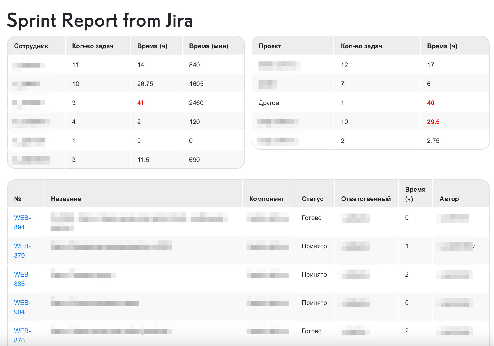

# jira_report_restapi
Custom sprint reports for jira (Rest API + cURL)
Кастомный отчет по спринту в Jira на основе фильтра.

Данный функционал обращается через cURL к Jira. Первым источником становится "Фильтр", в котором выбран параметр (в моем случае спринт). По первому обращению получаем jql ссылку, и по ней обращаемся конкретно к спринту и забираем информацию о задачах спринта. 

Отчет помогает спланировать задачи спринта равномерно по команде, так как на отчете это прозрачно видно. Наработку можно использовать для реализации других нужных отчетов, которые не возможно сформировать в Jira стандартными методами.

<a href="index.php">index.php</a> – Верстка таблиц с выводом трех отчетов (Отчет по заложенному времени по сотрудникам, по компонентам, и полноценная разбивка задач) 
<a href="functions.php">functions.php</a> – Функции, которые формируют отчет 
access.php – Доступы для обращения по Rest API в Jira

